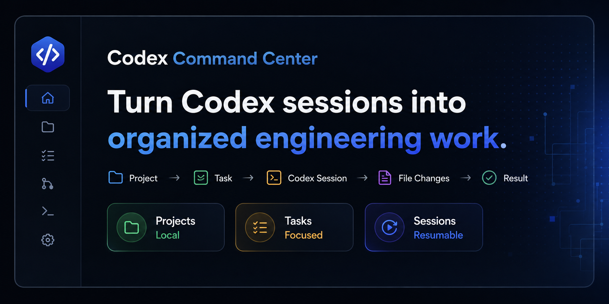
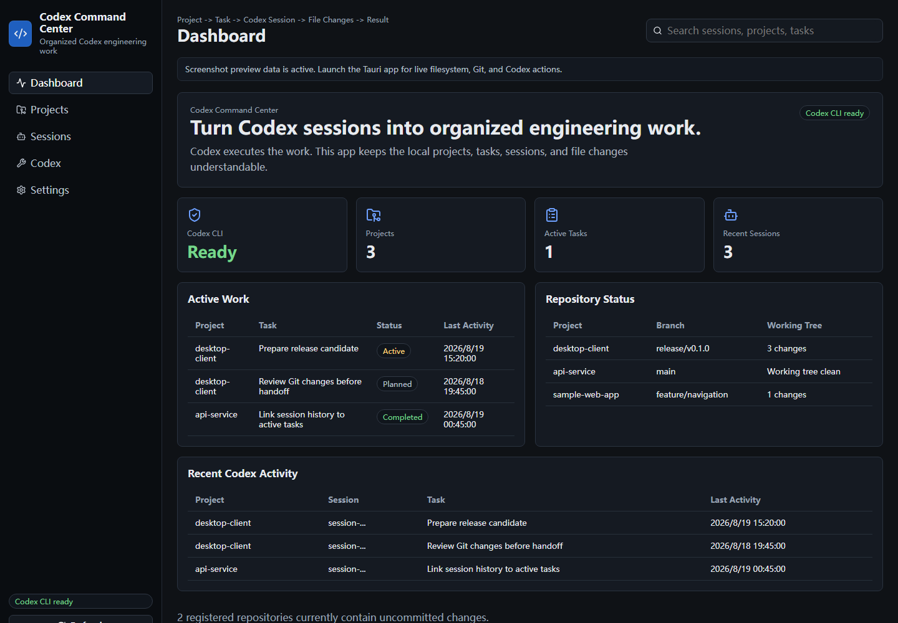
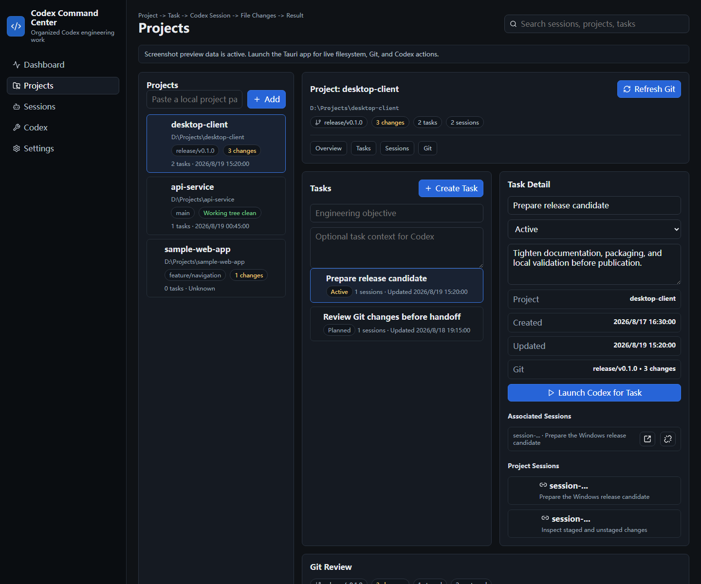
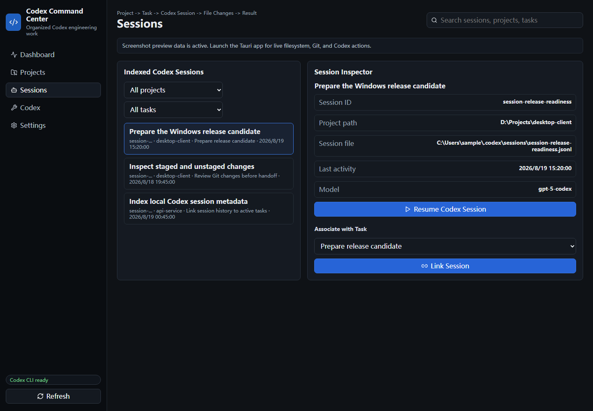
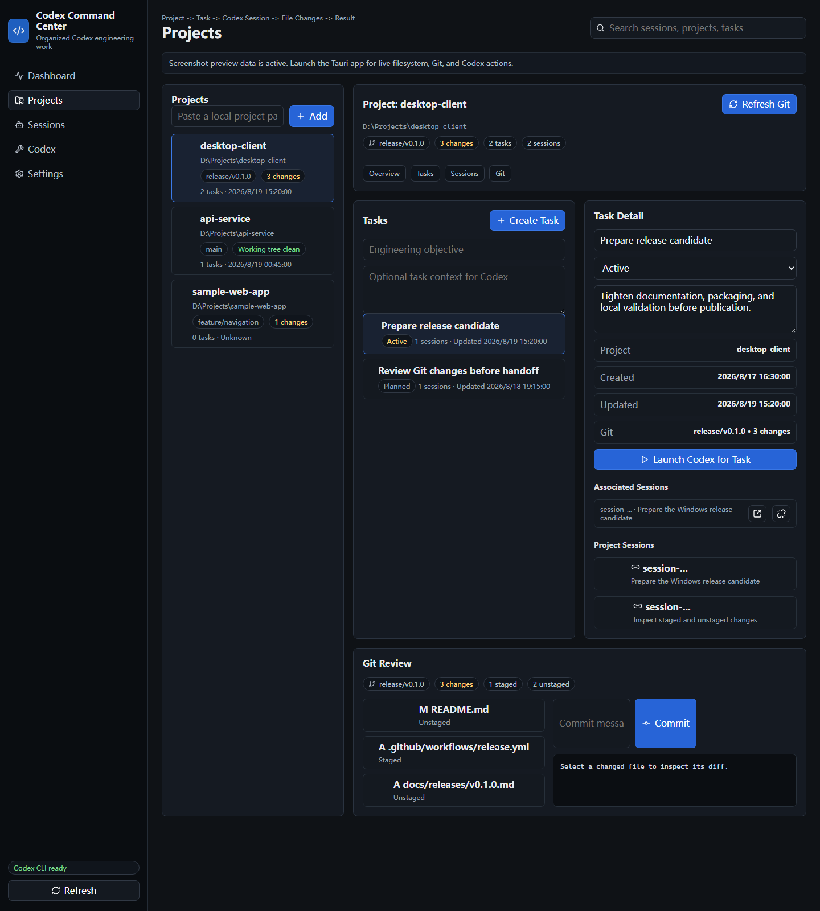
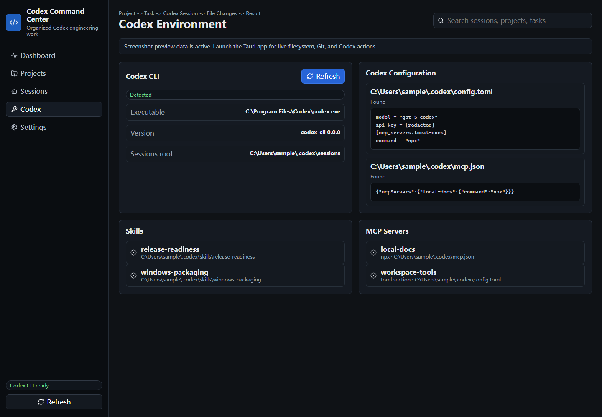

# Codex Command Center

**Turn Codex sessions into organized engineering work.**




Codex Command Center is a Windows-first, local-first desktop workspace for organizing Codex-based engineering work across projects, tasks, sessions, Git changes, Skills, and MCP configuration.

Codex does the reasoning, editing, commands, and tests. Codex Command Center keeps the surrounding engineering workflow understandable and resumable.

## Overview

Heavy Codex usage can leave useful context spread across:

- local repositories;
- engineering objectives;
- Codex session history;
- staged and unstaged Git changes;
- local Skills;
- MCP configuration.

Codex Command Center connects those pieces into one focused workflow:

```text
Project -> Task -> Codex Session -> File Changes -> Result
```

The app is intentionally smaller than an IDE, terminal emulator, chat client, or advanced Git GUI. It is an organizing layer for local Codex work.

## Screenshots

| Dashboard | Projects and tasks |
| --- | --- |
|  |  |

| Sessions | Git changes |
| --- | --- |
|  |  |

| Codex environment |
| --- |
|  |

## Core features

- **Project organization**: register local development folders and see branch, Git state, task counts, and recent activity.
- **Task tracking**: organize engineering objectives with Planned, Active, Completed, and Blocked statuses.
- **Codex session discovery**: index local Codex session metadata without mutating Codex session files.
- **Session workflows**: link sessions to tasks, launch Codex for a task, and resume selected sessions through the local Codex CLI.
- **Git review**: inspect branch, staged files, unstaged files, working-tree state, and per-file diffs; stage, unstage, and commit focused changes.
- **Codex environment visibility**: show detected Codex CLI path/version, redacted local configuration previews, discoverable Skills, and MCP server summaries.
- **Local-first storage**: keep projects, tasks, session links, and settings on the local machine.

## Typical workflow

```text
Add a repository
-> create or select an engineering task
-> launch or resume Codex work
-> review indexed sessions
-> inspect Git changes
-> continue, complete, or block the task
```

## Local-first behavior

The app stores its own state as local JSON under the user's local application data directory. Registered projects are path references; Codex Command Center does not copy project source code into application storage.

The native layer reads local Codex session metadata, local Codex configuration files, local Skills folders, local MCP configuration, and Git status for registered projects. Configuration previews redact lines that appear to contain keys, tokens, secrets, or passwords.

The project does not add telemetry, analytics, accounts, cloud synchronization, source-code upload, Codex-session upload, or Git-diff upload. The app can still invoke external local tools such as `codex` and `git`; those tools have their own behavior and configuration.

## Requirements

- Windows 11 is the primary supported platform.
- Node.js 20 or newer.
- Rust and Cargo for Tauri desktop development and production builds.
- Git on `PATH` for Git review.
- Codex CLI on `PATH` for launch and resume actions.

## Installation

Prebuilt Windows packages are intended to be published from tagged releases. Until a GitHub Release is created, build from source.

## Development

Install dependencies:

```bash
npm ci
```

Run the browser development surface:

```bash
npm run dev
```

Run the desktop app:

```bash
npm run tauri:dev
```

Run the frontend production build:

```bash
npm run build
```

Run the lightweight tracked-file secret scan:

```bash
npm run check:secrets
```

## Build

Build the desktop application:

```bash
npm run tauri:build
```

For native checks when Cargo is available:

```bash
cargo fmt --manifest-path src-tauri/Cargo.toml -- --check
cargo check --manifest-path src-tauri/Cargo.toml
cargo test --manifest-path src-tauri/Cargo.toml
cargo clippy --manifest-path src-tauri/Cargo.toml --all-targets --all-features -- -D warnings
```

## Architecture

- **Frontend**: React and TypeScript under `src/`.
- **Desktop shell**: Tauri 2 configuration under `src-tauri/`.
- **Native commands**: Rust commands for local filesystem, process launch, Git, Codex session indexing, Skills discovery, and MCP configuration summaries.
- **Storage**: local JSON state under the user's local application data directory.
- **Codex integration**: local Codex CLI detection plus launch/resume commands.
- **Git integration**: local Git CLI calls for branch, status, diff, stage, unstage, and commit operations.

## Relationship to CodMate

Codex Command Center evolved from the open-source CodMate project by Loocor. Upstream work is acknowledged, and applicable Apache-2.0 licensing and attribution are preserved in `LICENSE`, `NOTICE`, and `THIRD-PARTY-NOTICES.md`.

This project has been substantially refocused and reworked around a Windows-first, Codex-centric workflow for projects, tasks, sessions, and Git changes. It should not be described as built entirely from scratch.

## Contributing

See [CONTRIBUTING.md](CONTRIBUTING.md).

## Security

See [SECURITY.md](SECURITY.md).

## Roadmap

See [ROADMAP.md](ROADMAP.md).

## Release notes

Release candidate notes are available under [docs/releases/v0.1.0.md](docs/releases/v0.1.0.md).

## License

Codex Command Center is distributed under the [Apache License 2.0](LICENSE).

## Disclaimer

Codex Command Center is an independent open-source project and is not an official OpenAI product. OpenAI, Codex, and related marks belong to their respective owners.
